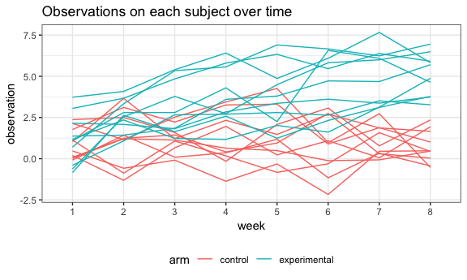
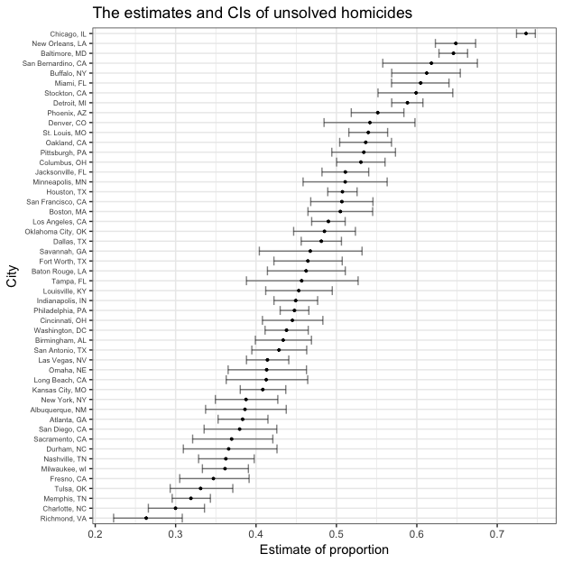

p8105\_hw5\_sl4471
================
Shuwei Liu
11/6/2018

Problem 1
---------

### 1.1 Import and tidy data

``` r
longitudinal_study = 
  tibble(file_name = list.files("./data")) %>% 
  mutate(result = map((str_c("./data/", file_name)), read_csv)) %>% 
  unnest()
longitudinal_study
```

    ## # A tibble: 20 x 9
    ##    file_name  week_1 week_2 week_3 week_4 week_5 week_6 week_7 week_8
    ##    <chr>       <dbl>  <dbl>  <dbl>  <dbl>  <dbl>  <dbl>  <dbl>  <dbl>
    ##  1 con_01.csv   0.2  -1.31    0.66   1.96   0.23   1.09   0.05   1.94
    ##  2 con_02.csv   1.13 -0.88    1.07   0.17  -0.83  -0.31   1.58   0.44
    ##  3 con_03.csv   1.77  3.11    2.22   3.26   3.31   0.89   1.88   1.01
    ##  4 con_04.csv   1.04  3.66    1.22   2.33   1.47   2.7    1.87   1.66
    ##  5 con_05.csv   0.47 -0.580  -0.09  -1.37  -0.32  -2.17   0.45   0.48
    ##  6 con_06.csv   2.37  2.5     1.59  -0.16   2.08   3.07   0.78   2.35
    ##  7 con_07.csv   0.03  1.21    1.13   0.64   0.49  -0.12  -0.07   0.46
    ##  8 con_08.csv  -0.08  1.42    0.09   0.36   1.18  -1.16   0.33  -0.44
    ##  9 con_09.csv   0.08  1.24    1.44   0.41   0.95   2.75   0.3    0.03
    ## 10 con_10.csv   2.14  1.15    2.52   3.44   4.26   0.97   2.73  -0.53
    ## 11 exp_01.csv   3.05  3.67    4.84   5.8    6.33   5.46   6.38   5.91
    ## 12 exp_02.csv  -0.84  2.63    1.64   2.58   1.24   2.32   3.11   3.78
    ## 13 exp_03.csv   2.15  2.08    1.82   2.84   3.36   3.61   3.37   3.74
    ## 14 exp_04.csv  -0.62  2.54    3.78   2.73   4.49   5.82   6      6.49
    ## 15 exp_05.csv   0.7   3.33    5.34   5.57   6.9    6.66   6.24   6.95
    ## 16 exp_06.csv   3.73  4.08    5.4    6.41   4.87   6.09   7.66   5.83
    ## 17 exp_07.csv   1.18  2.35    1.23   1.17   2.02   1.61   3.13   4.88
    ## 18 exp_08.csv   1.37  1.43    1.84   3.6    3.8    4.72   4.68   5.7 
    ## 19 exp_09.csv  -0.4   1.08    2.66   2.7    2.8    2.64   3.51   3.27
    ## 20 exp_10.csv   1.09  2.8     2.8    4.3    2.25   6.57   6.09   4.64

``` r
longitudinal_tidy =
  longitudinal_study %>% 
  separate(file_name, into = c("arm", "id"), sep = "_") %>% 
  gather(key = week, value = observation, week_1:week_8) %>% 
  mutate(id = str_replace(id, ".csv", ""),
         arm = str_replace(arm, "con", "control"),
         arm = str_replace(arm, "exp", "experimental"),
         week = str_replace(week, "week_", ""))
longitudinal_tidy
```

    ## # A tibble: 160 x 4
    ##    arm     id    week  observation
    ##    <chr>   <chr> <chr>       <dbl>
    ##  1 control 01    1            0.2 
    ##  2 control 02    1            1.13
    ##  3 control 03    1            1.77
    ##  4 control 04    1            1.04
    ##  5 control 05    1            0.47
    ##  6 control 06    1            2.37
    ##  7 control 07    1            0.03
    ##  8 control 08    1           -0.08
    ##  9 control 09    1            0.08
    ## 10 control 10    1            2.14
    ## # ... with 150 more rows

### 1.2 Spaghetti plot

``` r
longitudinal_tidy %>% 
  mutate(arm_id = str_c(arm, "_", id)) %>% 
  ggplot(aes(x = week, y = observation, group = arm_id, color = arm)) +
  geom_line() +
  labs(title = "Observations on each subject over time") 
```



In order to compare the results of different group clearly, I chose to differentiate lines by arms. I also tried to show the plot in two panels and made each individual to have different colors. However, the latter one was a little bit messy and made it harder to detect the trend of the observations overtime.

From the plot, the observation values of experimental arm group tended to increase compared with control group.

Problem 2
---------

### 2.1 Import data

``` r
homicides = read_csv("./homicide-data.csv")
```

    ## Parsed with column specification:
    ## cols(
    ##   uid = col_character(),
    ##   reported_date = col_integer(),
    ##   victim_last = col_character(),
    ##   victim_first = col_character(),
    ##   victim_race = col_character(),
    ##   victim_age = col_character(),
    ##   victim_sex = col_character(),
    ##   city = col_character(),
    ##   state = col_character(),
    ##   lat = col_double(),
    ##   lon = col_double(),
    ##   disposition = col_character()
    ## )

``` r
str(homicides)
```

    ## Classes 'tbl_df', 'tbl' and 'data.frame':    52179 obs. of  12 variables:
    ##  $ uid          : chr  "Alb-000001" "Alb-000002" "Alb-000003" "Alb-000004" ...
    ##  $ reported_date: int  20100504 20100216 20100601 20100101 20100102 20100126 20100127 20100127 20100130 20100210 ...
    ##  $ victim_last  : chr  "GARCIA" "MONTOYA" "SATTERFIELD" "MENDIOLA" ...
    ##  $ victim_first : chr  "JUAN" "CAMERON" "VIVIANA" "CARLOS" ...
    ##  $ victim_race  : chr  "Hispanic" "Hispanic" "White" "Hispanic" ...
    ##  $ victim_age   : chr  "78" "17" "15" "32" ...
    ##  $ victim_sex   : chr  "Male" "Male" "Female" "Male" ...
    ##  $ city         : chr  "Albuquerque" "Albuquerque" "Albuquerque" "Albuquerque" ...
    ##  $ state        : chr  "NM" "NM" "NM" "NM" ...
    ##  $ lat          : num  35.1 35.1 35.1 35.1 35.1 ...
    ##  $ lon          : num  -107 -107 -107 -107 -107 ...
    ##  $ disposition  : chr  "Closed without arrest" "Closed by arrest" "Closed without arrest" "Closed by arrest" ...
    ##  - attr(*, "spec")=List of 2
    ##   ..$ cols   :List of 12
    ##   .. ..$ uid          : list()
    ##   .. .. ..- attr(*, "class")= chr  "collector_character" "collector"
    ##   .. ..$ reported_date: list()
    ##   .. .. ..- attr(*, "class")= chr  "collector_integer" "collector"
    ##   .. ..$ victim_last  : list()
    ##   .. .. ..- attr(*, "class")= chr  "collector_character" "collector"
    ##   .. ..$ victim_first : list()
    ##   .. .. ..- attr(*, "class")= chr  "collector_character" "collector"
    ##   .. ..$ victim_race  : list()
    ##   .. .. ..- attr(*, "class")= chr  "collector_character" "collector"
    ##   .. ..$ victim_age   : list()
    ##   .. .. ..- attr(*, "class")= chr  "collector_character" "collector"
    ##   .. ..$ victim_sex   : list()
    ##   .. .. ..- attr(*, "class")= chr  "collector_character" "collector"
    ##   .. ..$ city         : list()
    ##   .. .. ..- attr(*, "class")= chr  "collector_character" "collector"
    ##   .. ..$ state        : list()
    ##   .. .. ..- attr(*, "class")= chr  "collector_character" "collector"
    ##   .. ..$ lat          : list()
    ##   .. .. ..- attr(*, "class")= chr  "collector_double" "collector"
    ##   .. ..$ lon          : list()
    ##   .. .. ..- attr(*, "class")= chr  "collector_double" "collector"
    ##   .. ..$ disposition  : list()
    ##   .. .. ..- attr(*, "class")= chr  "collector_character" "collector"
    ##   ..$ default: list()
    ##   .. ..- attr(*, "class")= chr  "collector_guess" "collector"
    ##   ..- attr(*, "class")= chr "col_spec"

This is a "tbl\_df" dataset containing 52179 observations and 12 variables. The "52179\*12" dataset have 12 variables including "uid", "reported\_date", "victim\_last", "victim\_first", "victim\_race", "victim\_age", "victim\_sex", "city", "state", "lat", "lon" and "disposition". It tells us the situation of homicide cases over years in 50 large cities of US.

### 2.2 The number of homicides

``` r
homicides_tidy = 
  homicides %>% 
  janitor::clean_names() %>% 
  mutate(city_state = str_c(city, ", ",  state))

homicides_total =
  homicides_tidy %>% 
  group_by(city_state) %>% 
  summarize(n_total = n()) %>% 
  filter(!(n_total == 1) )

homicides_unsolved =
  homicides_tidy %>% 
  filter(disposition %in% c("Closed without arrest", "Open/No arrest")) %>% 
  group_by(city_state) %>% 
  summarize(n_unsolved = n())
```

We can know about the total number of homicides and the number of unsolved cases of each city. I notice that there are 51 cities in "homicides\_total" dataset while there are 50 cities in "homicides\_unsolved" dataset. The odd one is "Tulsa, AL". I filter this observation out to make it easier to do the following "prop.test" and assume that this was a mistake in raw data since there was only one homicide case in this city.

``` r
baltimore_total = 
  homicides_total %>% 
  filter(city_state == "Baltimore, MD")

baltimore_unsolved = 
  homicides_unsolved %>% 
  filter(city_state == "Baltimore, MD")

baltimore_unsolved_prop = 
  prop.test(baltimore_unsolved$n_unsolved, baltimore_total$n_total)

baltimore_unsolved_prop %>%
  broom::tidy() %>% 
  select(estimate, conf.low, conf.high) %>% 
  knitr::kable(digits = 3)
```

|  estimate|  conf.low|  conf.high|
|---------:|---------:|----------:|
|     0.646|     0.628|      0.663|

The estimate proportion of unsolved homicides in baltimore is 64.56%. And the confidence interval is \[62.76%, 66.32%\].

``` r
unsolved_prop = 
  homicides_unsolved %>% 
  mutate(prop_all = map2(.x = homicides_unsolved$n_unsolved, 
                         .y = homicides_total$n_total, ~prop.test(.x, .y))) %>% 
  mutate(prop_all = map(prop_all, broom::tidy))

list_columns = 
  unsolved_prop %>% pull(prop_all)
list_columns
```

    ## [[1]]
    ## # A tibble: 1 x 8
    ##   estimate statistic p.value parameter conf.low conf.high method
    ##      <dbl>     <dbl>   <dbl>     <int>    <dbl>     <dbl> <chr> 
    ## 1    0.386      19.1 1.23e-5         1    0.337     0.438 1-sam…
    ## # ... with 1 more variable: alternative <chr>
    ## 
    ## [[2]]
    ## # A tibble: 1 x 8
    ##   estimate statistic  p.value parameter conf.low conf.high method
    ##      <dbl>     <dbl>    <dbl>     <int>    <dbl>     <dbl> <chr> 
    ## 1    0.383      52.5 4.32e-13         1    0.353     0.415 1-sam…
    ## # ... with 1 more variable: alternative <chr>
    ## 
    ## [[3]]
    ## # A tibble: 1 x 8
    ##   estimate statistic  p.value parameter conf.low conf.high method
    ##      <dbl>     <dbl>    <dbl>     <int>    <dbl>     <dbl> <chr> 
    ## 1    0.646      239. 6.46e-54         1    0.628     0.663 1-sam…
    ## # ... with 1 more variable: alternative <chr>
    ## 
    ## [[4]]
    ## # A tibble: 1 x 8
    ##   estimate statistic p.value parameter conf.low conf.high method
    ##      <dbl>     <dbl>   <dbl>     <int>    <dbl>     <dbl> <chr> 
    ## 1    0.462      2.27   0.132         1    0.414     0.511 1-sam…
    ## # ... with 1 more variable: alternative <chr>
    ## 
    ## [[5]]
    ## # A tibble: 1 x 8
    ##   estimate statistic p.value parameter conf.low conf.high method
    ##      <dbl>     <dbl>   <dbl>     <int>    <dbl>     <dbl> <chr> 
    ## 1    0.434      13.8 2.05e-4         1    0.399     0.469 1-sam…
    ## # ... with 1 more variable: alternative <chr>
    ## 
    ## [[6]]
    ## # A tibble: 1 x 8
    ##   estimate statistic p.value parameter conf.low conf.high method
    ##      <dbl>     <dbl>   <dbl>     <int>    <dbl>     <dbl> <chr> 
    ## 1    0.505    0.0407   0.840         1    0.465     0.545 1-sam…
    ## # ... with 1 more variable: alternative <chr>
    ## 
    ## [[7]]
    ## # A tibble: 1 x 8
    ##   estimate statistic p.value parameter conf.low conf.high method
    ##      <dbl>     <dbl>   <dbl>     <int>    <dbl>     <dbl> <chr> 
    ## 1    0.612      25.8 3.73e-7         1    0.569     0.654 1-sam…
    ## # ... with 1 more variable: alternative <chr>
    ## 
    ## [[8]]
    ## # A tibble: 1 x 8
    ##   estimate statistic  p.value parameter conf.low conf.high method
    ##      <dbl>     <dbl>    <dbl>     <int>    <dbl>     <dbl> <chr> 
    ## 1    0.300      109. 1.41e-25         1    0.266     0.336 1-sam…
    ## # ... with 1 more variable: alternative <chr>
    ## 
    ## [[9]]
    ## # A tibble: 1 x 8
    ##   estimate statistic   p.value parameter conf.low conf.high method
    ##      <dbl>     <dbl>     <dbl>     <int>    <dbl>     <dbl> <chr> 
    ## 1    0.736     1231. 1.28e-269         1    0.724     0.747 1-sam…
    ## # ... with 1 more variable: alternative <chr>
    ## 
    ## [[10]]
    ## # A tibble: 1 x 8
    ##   estimate statistic p.value parameter conf.low conf.high method
    ##      <dbl>     <dbl>   <dbl>     <int>    <dbl>     <dbl> <chr> 
    ## 1    0.445      8.11 0.00441         1    0.408     0.483 1-sam…
    ## # ... with 1 more variable: alternative <chr>
    ## 
    ## [[11]]
    ## # A tibble: 1 x 8
    ##   estimate statistic p.value parameter conf.low conf.high method
    ##      <dbl>     <dbl>   <dbl>     <int>    <dbl>     <dbl> <chr> 
    ## 1    0.530      3.90  0.0484         1    0.500     0.560 1-sam…
    ## # ... with 1 more variable: alternative <chr>
    ## 
    ## [[12]]
    ## # A tibble: 1 x 8
    ##   estimate statistic p.value parameter conf.low conf.high method
    ##      <dbl>     <dbl>   <dbl>     <int>    <dbl>     <dbl> <chr> 
    ## 1    0.481      2.15   0.143         1    0.456     0.506 1-sam…
    ## # ... with 1 more variable: alternative <chr>
    ## 
    ## [[13]]
    ## # A tibble: 1 x 8
    ##   estimate statistic p.value parameter conf.low conf.high method
    ##      <dbl>     <dbl>   <dbl>     <int>    <dbl>     <dbl> <chr> 
    ## 1    0.542      2.00   0.157         1    0.485     0.598 1-sam…
    ## # ... with 1 more variable: alternative <chr>
    ## 
    ## [[14]]
    ## # A tibble: 1 x 8
    ##   estimate statistic  p.value parameter conf.low conf.high method
    ##      <dbl>     <dbl>    <dbl>     <int>    <dbl>     <dbl> <chr> 
    ## 1    0.588      78.3 9.03e-19         1    0.569     0.608 1-sam…
    ## # ... with 1 more variable: alternative <chr>
    ## 
    ## [[15]]
    ## # A tibble: 1 x 8
    ##   estimate statistic p.value parameter conf.low conf.high method
    ##      <dbl>     <dbl>   <dbl>     <int>    <dbl>     <dbl> <chr> 
    ## 1    0.366      19.3 1.11e-5         1    0.310     0.426 1-sam…
    ## # ... with 1 more variable: alternative <chr>
    ## 
    ## [[16]]
    ## # A tibble: 1 x 8
    ##   estimate statistic p.value parameter conf.low conf.high method
    ##      <dbl>     <dbl>   <dbl>     <int>    <dbl>     <dbl> <chr> 
    ## 1    0.464      2.63   0.105         1    0.422     0.507 1-sam…
    ## # ... with 1 more variable: alternative <chr>
    ## 
    ## [[17]]
    ## # A tibble: 1 x 8
    ##   estimate statistic  p.value parameter conf.low conf.high method
    ##      <dbl>     <dbl>    <dbl>     <int>    <dbl>     <dbl> <chr> 
    ## 1    0.347      45.0 1.99e-11         1    0.305     0.391 1-sam…
    ## # ... with 1 more variable: alternative <chr>
    ## 
    ## [[18]]
    ## # A tibble: 1 x 8
    ##   estimate statistic p.value parameter conf.low conf.high method
    ##      <dbl>     <dbl>   <dbl>     <int>    <dbl>     <dbl> <chr> 
    ## 1    0.507     0.628   0.428         1    0.489     0.526 1-sam…
    ## # ... with 1 more variable: alternative <chr>
    ## 
    ## [[19]]
    ## # A tibble: 1 x 8
    ##   estimate statistic p.value parameter conf.low conf.high method
    ##      <dbl>     <dbl>   <dbl>     <int>    <dbl>     <dbl> <chr> 
    ## 1    0.449      13.4 2.54e-4         1    0.422     0.477 1-sam…
    ## # ... with 1 more variable: alternative <chr>
    ## 
    ## [[20]]
    ## # A tibble: 1 x 8
    ##   estimate statistic p.value parameter conf.low conf.high method
    ##      <dbl>     <dbl>   <dbl>     <int>    <dbl>     <dbl> <chr> 
    ## 1    0.511     0.535   0.464         1    0.482     0.540 1-sam…
    ## # ... with 1 more variable: alternative <chr>
    ## 
    ## [[21]]
    ## # A tibble: 1 x 8
    ##   estimate statistic  p.value parameter conf.low conf.high method
    ##      <dbl>     <dbl>    <dbl>     <int>    <dbl>     <dbl> <chr> 
    ## 1    0.408      39.6 3.16e-10         1    0.380     0.437 1-sam…
    ## # ... with 1 more variable: alternative <chr>
    ## 
    ## [[22]]
    ## # A tibble: 1 x 8
    ##   estimate statistic  p.value parameter conf.low conf.high method
    ##      <dbl>     <dbl>    <dbl>     <int>    <dbl>     <dbl> <chr> 
    ## 1    0.414      40.3 2.14e-10         1    0.388     0.441 1-sam…
    ## # ... with 1 more variable: alternative <chr>
    ## 
    ## [[23]]
    ## # A tibble: 1 x 8
    ##   estimate statistic p.value parameter conf.low conf.high method
    ##      <dbl>     <dbl>   <dbl>     <int>    <dbl>     <dbl> <chr> 
    ## 1    0.413      11.2 8.28e-4         1    0.363     0.464 1-sam…
    ## # ... with 1 more variable: alternative <chr>
    ## 
    ## [[24]]
    ## # A tibble: 1 x 8
    ##   estimate statistic p.value parameter conf.low conf.high method
    ##      <dbl>     <dbl>   <dbl>     <int>    <dbl>     <dbl> <chr> 
    ## 1    0.490     0.858   0.354         1    0.469     0.511 1-sam…
    ## # ... with 1 more variable: alternative <chr>
    ## 
    ## [[25]]
    ## # A tibble: 1 x 8
    ##   estimate statistic p.value parameter conf.low conf.high method
    ##      <dbl>     <dbl>   <dbl>     <int>    <dbl>     <dbl> <chr> 
    ## 1    0.453      4.88  0.0272         1    0.412     0.495 1-sam…
    ## # ... with 1 more variable: alternative <chr>
    ## 
    ## [[26]]
    ## # A tibble: 1 x 8
    ##   estimate statistic  p.value parameter conf.low conf.high method
    ##      <dbl>     <dbl>    <dbl>     <int>    <dbl>     <dbl> <chr> 
    ## 1    0.319      198. 6.88e-45         1    0.296     0.343 1-sam…
    ## # ... with 1 more variable: alternative <chr>
    ## 
    ## [[27]]
    ## # A tibble: 1 x 8
    ##   estimate statistic p.value parameter conf.low conf.high method
    ##      <dbl>     <dbl>   <dbl>     <int>    <dbl>     <dbl> <chr> 
    ## 1    0.605      32.3 1.33e-8         1    0.569     0.640 1-sam…
    ## # ... with 1 more variable: alternative <chr>
    ## 
    ## [[28]]
    ## # A tibble: 1 x 8
    ##   estimate statistic  p.value parameter conf.low conf.high method
    ##      <dbl>     <dbl>    <dbl>     <int>    <dbl>     <dbl> <chr> 
    ## 1    0.361      85.1 2.87e-20         1    0.333     0.391 1-sam…
    ## # ... with 1 more variable: alternative <chr>
    ## 
    ## [[29]]
    ## # A tibble: 1 x 8
    ##   estimate statistic p.value parameter conf.low conf.high method
    ##      <dbl>     <dbl>   <dbl>     <int>    <dbl>     <dbl> <chr> 
    ## 1    0.511     0.134   0.714         1    0.459     0.563 1-sam…
    ## # ... with 1 more variable: alternative <chr>
    ## 
    ## [[30]]
    ## # A tibble: 1 x 8
    ##   estimate statistic  p.value parameter conf.low conf.high method
    ##      <dbl>     <dbl>    <dbl>     <int>    <dbl>     <dbl> <chr> 
    ## 1    0.362      57.5 3.39e-14         1    0.329     0.398 1-sam…
    ## # ... with 1 more variable: alternative <chr>
    ## 
    ## [[31]]
    ## # A tibble: 1 x 8
    ##   estimate statistic  p.value parameter conf.low conf.high method
    ##      <dbl>     <dbl>    <dbl>     <int>    <dbl>     <dbl> <chr> 
    ## 1    0.649      126. 3.14e-29         1    0.623     0.673 1-sam…
    ## # ... with 1 more variable: alternative <chr>
    ## 
    ## [[32]]
    ## # A tibble: 1 x 8
    ##   estimate statistic p.value parameter conf.low conf.high method
    ##      <dbl>     <dbl>   <dbl>     <int>    <dbl>     <dbl> <chr> 
    ## 1    0.388      31.3 2.26e-8         1    0.349     0.427 1-sam…
    ## # ... with 1 more variable: alternative <chr>
    ## 
    ## [[33]]
    ## # A tibble: 1 x 8
    ##   estimate statistic p.value parameter conf.low conf.high method
    ##      <dbl>     <dbl>   <dbl>     <int>    <dbl>     <dbl> <chr> 
    ## 1    0.536      4.88  0.0271         1    0.504     0.569 1-sam…
    ## # ... with 1 more variable: alternative <chr>
    ## 
    ## [[34]]
    ## # A tibble: 1 x 8
    ##   estimate statistic p.value parameter conf.low conf.high method
    ##      <dbl>     <dbl>   <dbl>     <int>    <dbl>     <dbl> <chr> 
    ## 1    0.485     0.537   0.464         1    0.447     0.524 1-sam…
    ## # ... with 1 more variable: alternative <chr>
    ## 
    ## [[35]]
    ## # A tibble: 1 x 8
    ##   estimate statistic p.value parameter conf.low conf.high method
    ##      <dbl>     <dbl>   <dbl>     <int>    <dbl>     <dbl> <chr> 
    ## 1    0.413      12.0 5.38e-4         1    0.365     0.463 1-sam…
    ## # ... with 1 more variable: alternative <chr>
    ## 
    ## [[36]]
    ## # A tibble: 1 x 8
    ##   estimate statistic p.value parameter conf.low conf.high method
    ##      <dbl>     <dbl>   <dbl>     <int>    <dbl>     <dbl> <chr> 
    ## 1    0.448      32.9 9.80e-9         1    0.430     0.466 1-sam…
    ## # ... with 1 more variable: alternative <chr>
    ## 
    ## [[37]]
    ## # A tibble: 1 x 8
    ##   estimate statistic p.value parameter conf.low conf.high method
    ##      <dbl>     <dbl>   <dbl>     <int>    <dbl>     <dbl> <chr> 
    ## 1    0.551      9.46 0.00210         1    0.518     0.584 1-sam…
    ## # ... with 1 more variable: alternative <chr>
    ## 
    ## [[38]]
    ## # A tibble: 1 x 8
    ##   estimate statistic p.value parameter conf.low conf.high method
    ##      <dbl>     <dbl>   <dbl>     <int>    <dbl>     <dbl> <chr> 
    ## 1    0.534      2.80  0.0945         1    0.494     0.573 1-sam…
    ## # ... with 1 more variable: alternative <chr>
    ## 
    ## [[39]]
    ## # A tibble: 1 x 8
    ##   estimate statistic  p.value parameter conf.low conf.high method
    ##      <dbl>     <dbl>    <dbl>     <int>    <dbl>     <dbl> <chr> 
    ## 1    0.263      95.1 1.80e-22         1    0.223     0.308 1-sam…
    ## # ... with 1 more variable: alternative <chr>
    ## 
    ## [[40]]
    ## # A tibble: 1 x 8
    ##   estimate statistic p.value parameter conf.low conf.high method
    ##      <dbl>     <dbl>   <dbl>     <int>    <dbl>     <dbl> <chr> 
    ## 1    0.370      25.0 5.66e-7         1    0.321     0.421 1-sam…
    ## # ... with 1 more variable: alternative <chr>
    ## 
    ## [[41]]
    ## # A tibble: 1 x 8
    ##   estimate statistic p.value parameter conf.low conf.high method
    ##      <dbl>     <dbl>   <dbl>     <int>    <dbl>     <dbl> <chr> 
    ## 1    0.429      16.7 4.34e-5         1    0.395     0.463 1-sam…
    ## # ... with 1 more variable: alternative <chr>
    ## 
    ## [[42]]
    ## # A tibble: 1 x 8
    ##   estimate statistic p.value parameter conf.low conf.high method
    ##      <dbl>     <dbl>   <dbl>     <int>    <dbl>     <dbl> <chr> 
    ## 1    0.618      14.9 1.14e-4         1    0.558     0.675 1-sam…
    ## # ... with 1 more variable: alternative <chr>
    ## 
    ## [[43]]
    ## # A tibble: 1 x 8
    ##   estimate statistic p.value parameter conf.low conf.high method
    ##      <dbl>     <dbl>   <dbl>     <int>    <dbl>     <dbl> <chr> 
    ## 1    0.380      26.2 3.00e-7         1    0.335     0.426 1-sam…
    ## # ... with 1 more variable: alternative <chr>
    ## 
    ## [[44]]
    ## # A tibble: 1 x 8
    ##   estimate statistic p.value parameter conf.low conf.high method
    ##      <dbl>     <dbl>   <dbl>     <int>    <dbl>     <dbl> <chr> 
    ## 1    0.507    0.0965   0.756         1    0.468     0.545 1-sam…
    ## # ... with 1 more variable: alternative <chr>
    ## 
    ## [[45]]
    ## # A tibble: 1 x 8
    ##   estimate statistic p.value parameter conf.low conf.high method
    ##      <dbl>     <dbl>   <dbl>     <int>    <dbl>     <dbl> <chr> 
    ## 1    0.467     0.915   0.339         1    0.404     0.532 1-sam…
    ## # ... with 1 more variable: alternative <chr>
    ## 
    ## [[46]]
    ## # A tibble: 1 x 8
    ##   estimate statistic p.value parameter conf.low conf.high method
    ##      <dbl>     <dbl>   <dbl>     <int>    <dbl>     <dbl> <chr> 
    ## 1    0.540      10.4 0.00127         1    0.515     0.564 1-sam…
    ## # ... with 1 more variable: alternative <chr>
    ## 
    ## [[47]]
    ## # A tibble: 1 x 8
    ##   estimate statistic p.value parameter conf.low conf.high method
    ##      <dbl>     <dbl>   <dbl>     <int>    <dbl>     <dbl> <chr> 
    ## 1    0.599      17.0 3.65e-5         1    0.552     0.645 1-sam…
    ## # ... with 1 more variable: alternative <chr>
    ## 
    ## [[48]]
    ## # A tibble: 1 x 8
    ##   estimate statistic p.value parameter conf.low conf.high method
    ##      <dbl>     <dbl>   <dbl>     <int>    <dbl>     <dbl> <chr> 
    ## 1    0.457      1.39   0.239         1    0.388     0.527 1-sam…
    ## # ... with 1 more variable: alternative <chr>
    ## 
    ## [[49]]
    ## # A tibble: 1 x 8
    ##   estimate statistic  p.value parameter conf.low conf.high method
    ##      <dbl>     <dbl>    <dbl>     <int>    <dbl>     <dbl> <chr> 
    ## 1    0.331      65.9 4.76e-16         1    0.293     0.371 1-sam…
    ## # ... with 1 more variable: alternative <chr>
    ## 
    ## [[50]]
    ## # A tibble: 1 x 8
    ##   estimate statistic p.value parameter conf.low conf.high method
    ##      <dbl>     <dbl>   <dbl>     <int>    <dbl>     <dbl> <chr> 
    ## 1    0.438      20.5 6.00e-6         1    0.411     0.465 1-sam…
    ## # ... with 1 more variable: alternative <chr>

``` r
unsolved_prop_tidy = 
  unsolved_prop %>% 
  unnest() %>% 
  select(city_state, estimate, conf.low, conf.high)
unsolved_prop_tidy
```

    ## # A tibble: 50 x 4
    ##    city_state      estimate conf.low conf.high
    ##    <chr>              <dbl>    <dbl>     <dbl>
    ##  1 Albuquerque, NM    0.386    0.337     0.438
    ##  2 Atlanta, GA        0.383    0.353     0.415
    ##  3 Baltimore, MD      0.646    0.628     0.663
    ##  4 Baton Rouge, LA    0.462    0.414     0.511
    ##  5 Birmingham, AL     0.434    0.399     0.469
    ##  6 Boston, MA         0.505    0.465     0.545
    ##  7 Buffalo, NY        0.612    0.569     0.654
    ##  8 Charlotte, NC      0.300    0.266     0.336
    ##  9 Chicago, IL        0.736    0.724     0.747
    ## 10 Cincinnati, OH     0.445    0.408     0.483
    ## # ... with 40 more rows

We can learn about the proportion of unsolved homicides of each city from the dataset above.

``` r
unsolved_prop_tidy %>% 
  mutate(city_state = fct_reorder(city_state, estimate)) %>% 
  ggplot(aes(x = city_state, y = estimate)) +
  geom_point(size = 0.7) +
  geom_errorbar(aes(ymin = conf.low, ymax = conf.high), alpha = 0.5) +
  coord_flip() +
  labs(
    title = "The estimates and CIs of unsolved homicides",
    x = "City",
    y = "Estimate of proportion") +
  theme(axis.text.y = element_text(size = 6, hjust = 1)) 
```



From the plot, Chicago has the highest proportion of unsolved homicides while Richmond has the lowest estimated value. Maybe it means that Chicago is much less safer than Richmond.
